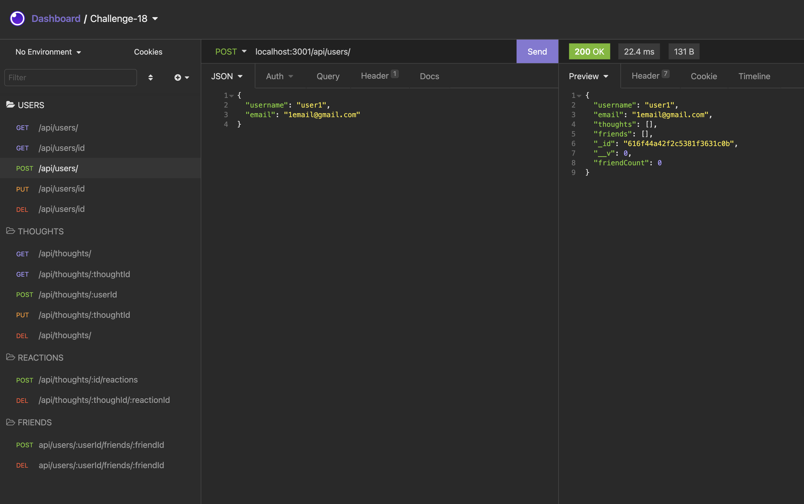

# social-network-api
unlicensed

## Description
This project creates the back end for an e-commerce site. It uses and  Express.js API configured to use Mongoose (an ODM)  to interact with a No-SQL database (MongoDB).  
[project link](https://github.com/gfernandez25/social-network-api)

## Table Of Contents
* [Installation](#user-content-installation)
* [Usage](#user-content-usage)
* [Licenses](#user-content-licenses)
* [Tests](#user-content-tests)
* [Questions](#user-content-questions)

## Installation
1. install npm express
2. install npm mongoose
3. install mongodb
4. Verify that the service is running by using the following command:
* ps aux | grep -v grep | grep mongod
5. run to following command to start the express server npm run start
6. routes can be tested with insomnia core or browser window

## Usage
Please see walk through video
[how to video](https://drive.google.com/file/d/16ucWXFki8Kr-HA13yySmfgAIWItfW8xX/view)

## Screenshot

Routes can be tested on Heroku.

https://obscure-tundra-07551.herokuapp.com/api/categories

https://lit-falls-58656.herokuapp.com/

## License

unlicensed

## Contributing
contribute however you can

## Tests
manual test only

## Questions
for any questions please contact me on my GitHub profile: [gfernandez25](https://github.com/gfernandez25)  

